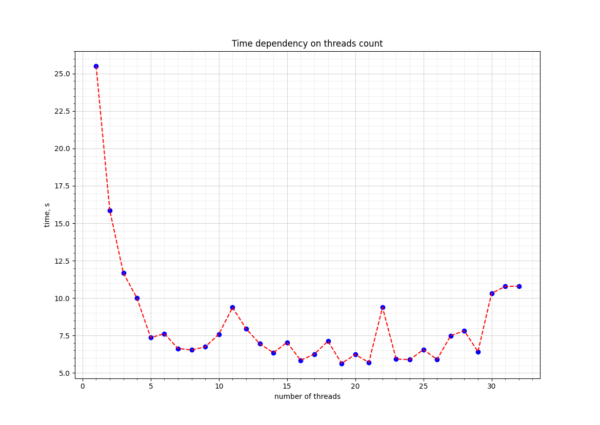
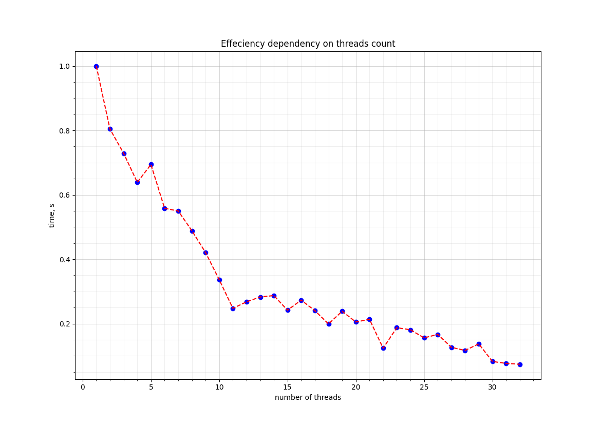
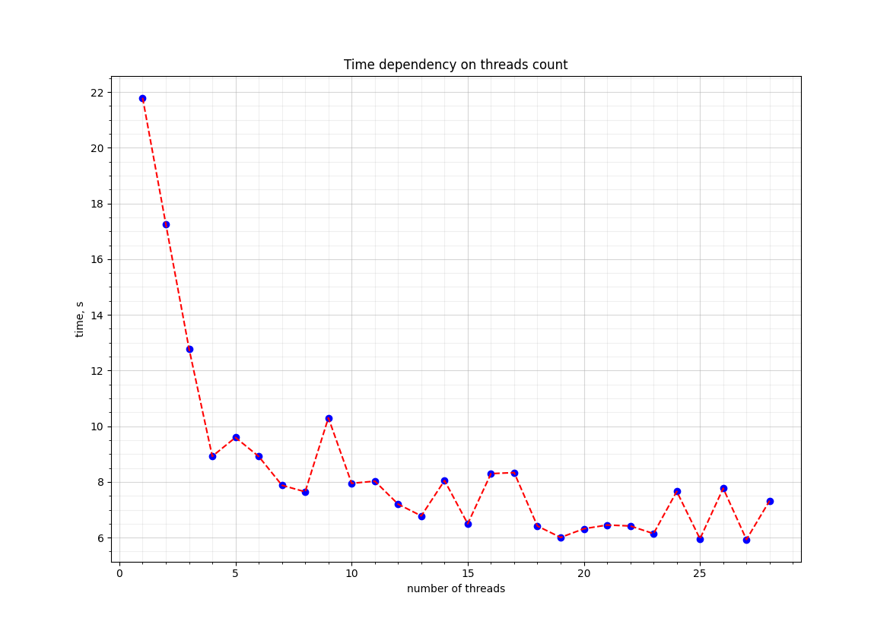
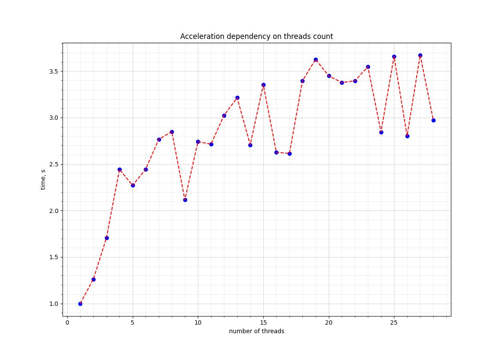
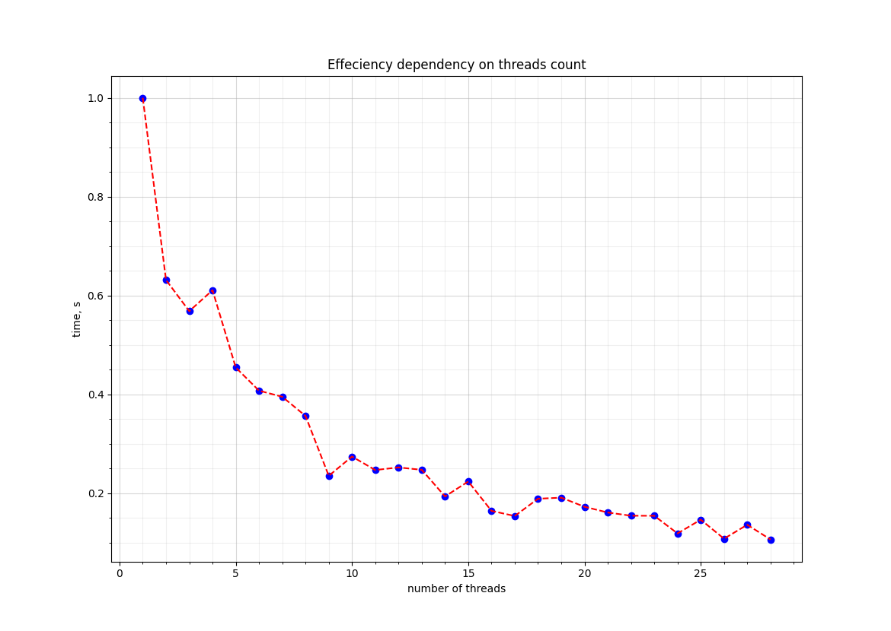

# Задание для допуска
## Вычислить вектор направлений для вашего варианта задания
### Первый цикл
```
for (i = 0; i < ISIZE; i++)
{
    for (j = 0; j < JSIZE; j++)
    {
        a[i][j] = sin(0.00001 * a[i][j]);
    }
}
```
$J = (i, j)$ - итерационный вектор \
$D = (0, 0)$ - вектор расстояний \
$d = ("=", "=")$ - вектор направлений

Цикл может быть распараллелен по произвольному количеству индексов без всяких ограничений, тип зависимости - антизависимость (нужно сначала взять данные, а потом их изменить)

### Второй цикл
```
for (i = 5; i < ISIZE; i++)
{
    for (j = 0; j < JSIZE - 2; j++)
    {
        b[i][j] = a[i - 5][j + 2] * 1.5;
    }
}
```

Цикл уже удовлетворяет условию Бернстайна, т.е. не пересекаются никак выходные данные между собой и входные с выходными (используем разные массивы) - *нет зависимости*. Поэтому не имеет смысла считать векторы расстояний и направлений, все параллелится по произвольному количеству индексов без всяких ограничений

# Задание к выполнению
Вариант задания - 3г

## Структура файлов
1) **generic_sequential.cpp** - общее для всех задание,  последовательная версия
2) **generic_parallel.cpp** - общее для всех задание, параллельная версия (с использованием MPI)
3) **personal_sequential.cpp** - персональный вариант, последовательная версия
4) **personal_parallel.cpp** - персональный вариант, параллельная версия

Компиляция программ:
```
mkdir build
cd build
cmake [-DOUTPUT_TO_FILE=1] ..
cmake --build .
```

*OUTPUT_TO_FILE* - включить вывод результатов вычислений в файл, по дефолту выключено

Скрипты для анализа производительности:

*job.sh* - скрипт для запуска программы с использованием очередей PBS

*run_script.sh* - запуск программы c очередями PBS в необходимом диапозоне потоков (например, от 1 до 32) 

*plot_res.py* - скрипт для построения графиков по измеренным данным

## Анализ результатов
Измерим написанные параллельные программы на кол-ве потоков от
1 до 28 (столько ядер доступно на кластере, большее кол-во 
потоков не имеет смысла) и размере массивов 20000 на 20000 (чтобы
была видна разница с последовательной программой, массив пришлось
взять побольше).


Общая для всех программа (измерено до 32 потоков, но видно, почему это не имеет 
смысла и почему можно ограничиться 28):

1) Время от кол-ва потоков

2) Ускорение от кол-ва потоков

3) Эффективность от кол-ва потоков


Персональный вариант
1) Время от кол-ва потоков

2) Ускорение от кол-ва потоков

3) Эффективность от кол-ва потоков



Из графиков видно следующее поведение - где-то до 5 потоков поведение соответствует ожидаемому: время с увеличением кол-ва потоков падает, ускорение растет, но эффективность все же падает. Сама программа параллелится идеально и больше
подходит для модели с общей памятью
(например, OpenMP), но из-за использования
MPI необходимо собирать данные со всех потоков с 
помощью функции ```MPI_Gatherv```, которая и
замедляет программу. С ростом числа потоков вычисления
выполняются быстрее, но замедляется работа этой функции,
из-за чего на $n$ потоках при времени выполнения на одном
потоке $T$ мы не получаем время $T / n$, а $T / n + f(n)$, 
где $f(n)$ - время выполнения ```MPI_Gatherv```, зависящее
от кол-ва потоков. На графиках видно, что в какой-то момент из-за
этой добавки ожидаемое монотонное убывание времени и возрастание ускорения пропадает, и график начинает колебаться
в окрестности какого-то значения.